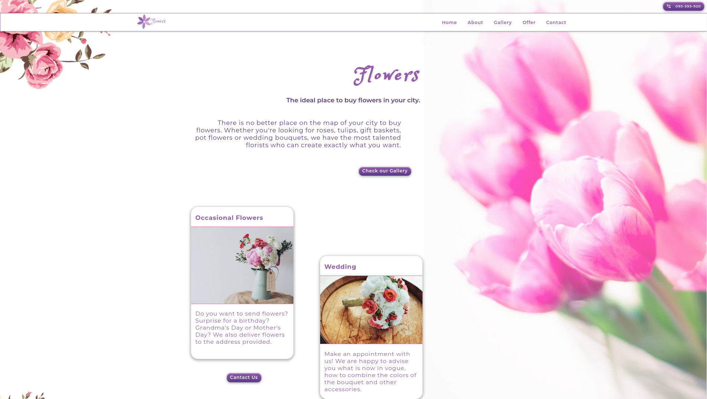

## Hello Guest! :sun_with_face:

  <h1 align="center">
  Flowers with Gatsby
  </h1>

<a href="https://nifty-borg-93e478.netlify.com/">
  
</a>


## :school: The project with gatsby default starter and DatoCms(Work in progress)

Florist's website built based on Gatsby and DatoCms. The project uses GraphQL queries for cms, from where data such as content or photos are dynamically fetched. There is also a contact form based on Firestore functions, SendGrid and 'formik' library, thanks to which you can send a message to my email.Styles are created using the 'styled components' library. Modal windows for product presentation and the 'react-images' library for the gallery are used.

## :star: Features

- gatsby-plugins
- react-google-maps
- react-icons
- react-images
- slugify
- styled-components
- body-scroll-lock
- axios
- formik
- dotenv

## :star: Tools

- Firebase functions
- SendGrid
- Google Maps API

## :rocket: Quick start

1.  **Create local.**

    Copy and paste in your terminal.

    ```shell
    git clone https://github.com/PiotrGrobelak/flowers_website.git
    ```

2.  **Start project.**

    Navigate into your directory and start it up.

    ```shell
    cd flowers_website/

    npm install

    gatsby develop
    ```

## Updates

# The next features will be implemented soon.


